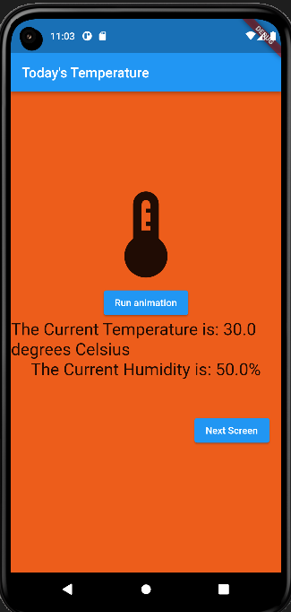

# sensor-project
Project3: Sensor Project

DISCLAIMER: to update sensors and screens you have to hot reload

Audience: the audience for the project is anyone needing a light weight weather app to show oncoming weather at the moment

Functionality: our app is able to use your phones sensors to grab ambient temperature, humidity, and atmospheric pressure to predict the weather in the short future as well as show outside conditions. 

Use case: the strongest use case is for people needing a light weight and free to use weather app that they can customize to their own needs as it is licensed as open source

## Images

